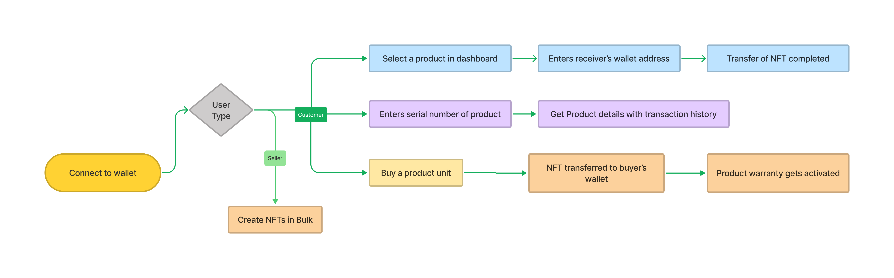

# Blockchain-based eCommerce warranty system using NFTs - Flipkart GRID 4.0

A secure blockchain based warranty system using which brands and retailers can list products in the form of digital NFTs. On the other hand, customers buying any product will get NFT based decaying digital warranty card along with the physical one. Using the blockchain public ledger, one can also prove their ownership of a product and see full transaction history.

## Key Features

* NFT based warranty
* Proof of ownership using blockchain ledger
* Transfer of product(NFT) ownership.
* Bulk creation of product by sellers.
* Fetch transfer history of an NFT

## Process Flow Diagram



## Tech Stack
* React JS
* Solidity
* Hardhat
* Metamask
* Openzeppelin
* Alchemy

## Local Environment Setup and Usage

To run this app locally on your PC, follow the instructions given below:

### Installation

1. Clone using ``` git clone repo name ```.
2. Use ```npm run install-modules``` in root folder to install all modules.

### Running application on localhost
1. Use ```npx hardhat node``` to run a local node. Import auto-generated accounts in Metamask.
2. Run command ```npx hardhat run scripts/deploy.js --network localhost``` to deploy contracts and update address in config.js file inside frontend/src folder.
3. Finally, run ```npm run client``` to spin up react app.


#### Note: Evertime you run a local node, reset your Metamask account.

## License

## Contributors

